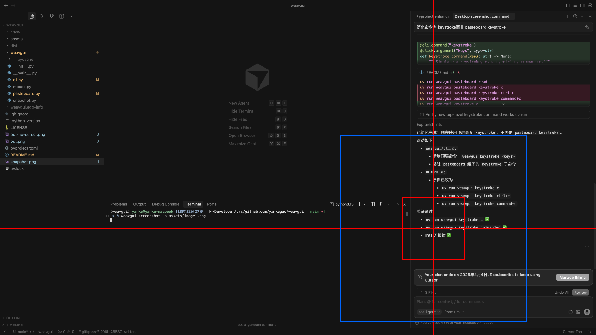

# weavgui

[English](README.md) | [中文](README.zh.md)

> **使用要求：** 需使用**具有视觉能力的大模型**，且类 Claw 平台需支持**从文件直接将图片载入上下文**。推荐使用 [weavbot](https://github.com/yankeguo/weavbot) 来实现该工作流。

**将任意具备视觉能力的 LLM 变成桌面 GUI 操作员。**

weavgui 提供一套 minimal CLI 工具，打通「看见」与「操作」的闭环：截一张带标注的屏幕、交给视觉模型分析、移动鼠标并执行点击，如此循环，直到模型精确点击目标位置。

```
截图（带十字准心）→ 视觉模型分析图像 → 鼠标移动/点击 → 截图 → ...
```

无需浏览器，不需要 DOM 或无障碍树，只有像素和反馈循环。

```shell
npx skills add https://github.com/yankeguo/weavgui/tree/main/skills/weavgui -a openclaw -y
```



## 安装

```bash
uv tool install weavgui
```

升级已安装版本：

```bash
uv tool upgrade weavgui
```

## 快速开始

```bash
weavgui --version
weavgui screenshot
weavgui mouse move '(0.05,0.05)'
weavgui mouse moveto '(0.5,0.3)'
weavgui mouse click
weavgui pasteboard write hello world
weavgui pasteboard read
weavgui keystroke command+c
```

## 自动截图行为

每个动作命令都会在短暂延迟后自动将截图保存到当前工作目录下的 **`screenshot.png`**，无需额外参数。

| Command | 自动截图延迟 |
|---|---|
| `screenshot` | 立即（无延迟） |
| `mouse move`、`mouse moveto` | 500 ms |
| `mouse click`、`doubleclick`、`rightclick` | 2 s |
| `keystroke` | 1 s |

截图始终包含光标标记（十字准心 + 参考框）。执行任意命令后读取 `screenshot.png` 即可观察结果。

## 坐标系

鼠标与截图相关命令使用**归一化坐标**：

- 取值范围 `0.0` 到 `1.0`
- 原点在左上角：`(0.0, 0.0)`，右下角为 `(1.0, 1.0)`
- `x` 向右递增（屏幕宽度的比例），`y` 向下递增（屏幕高度的比例）
- 仅支持主显示器（单显示器）
- 与分辨率无关：相同的坐标在任何屏幕尺寸和 DPI 下都有效

## 命令参考

### Global

| Command | 说明 |
|---|---|
| `weavgui --version` | 打印 CLI 版本 |
| `weavgui -h` | 显示帮助 |

### `screenshot`

捕获主显示器截图并保存为当前工作目录下的 `screenshot.png`。

```
weavgui screenshot
```

光标位置始终会被标注：

- 红色十字准心贯穿整张截图
- 以光标为中心的红色小框（归一化半径 0.03）
- 以光标为中心的绿色中框（归一化半径 0.07）
- 以光标为中心的蓝色大框（归一化半径 0.20）

三个框作为下一次 `mouse move` / `mouse moveto` 的**定位参考**：

| 目标位置 | 建议偏移范围 |
|---|---|
| 红色框内 | 微调，`±0.03` |
| 红绿框之间 | 中等调整，`±0.03–0.07` |
| 绿蓝框之间 | 粗调，`±0.07–0.20` |
| 蓝色框外 | 需要较大移动，根据整张截图估算 |

```bash
weavgui screenshot
# → 保存带光标标记的 screenshot.png
# → 将光标归一化坐标输出到 stdout
```

### `mouse`

#### `mouse move '(dx,dy)'`

按归一化相对偏移移动光标。参数格式为 `(dx,dy)`。若目标位置超出有效范围 `[0.0, 1.0)` 则失败。移动后等待 500 ms 并将截图保存到 `screenshot.png`。

```bash
weavgui mouse move '(0.05,0.05)'
weavgui mouse move '(-0.05,0.03)'
```

#### `mouse moveto '(x,y)'`

将光标移动到归一化绝对坐标。参数格式为 `(x,y)`。若坐标超出有效范围 `[0.0, 1.0)` 则失败。移动后等待 500 ms 并将截图保存到 `screenshot.png`。

```bash
weavgui mouse moveto '(0.5,0.3)'
```

#### `mouse click`

在当前光标位置左键单击。等待 2 s 后将截图保存到 `screenshot.png`。

```bash
weavgui mouse click
```

#### `mouse doubleclick`

在当前光标位置左键双击。等待 2 s 后将截图保存到 `screenshot.png`。

```bash
weavgui mouse doubleclick
```

#### `mouse rightclick`

在当前光标位置右键单击。等待 2 s 后将截图保存到 `screenshot.png`。

```bash
weavgui mouse rightclick
```

### `pasteboard`

#### `pasteboard read`

从系统剪贴板读取文本并输出到 stdout。

```bash
weavgui pasteboard read
```

#### `pasteboard write <text...>`

将文本写入系统剪贴板。多个参数用单个空格连接。

```bash
weavgui pasteboard write hello world
```

### `keystroke`

模拟键盘输入。支持单键及以 `+` 连接的组合键。等待 1 s 后将截图保存到 `screenshot.png`。

```
weavgui keystroke <keys>
```

| Input | 含义 |
|---|---|
| `c` | 按下 `c` |
| `ctrl+c` | 按下 Ctrl+C |
| `command+c` | 按下 Command+C |
| `shift+a` | 按下 Shift+A |
| `alt+f4` | 按下 Alt+F4 |

修饰键别名：

| Alias | 对应 |
|---|---|
| `control` | `ctrl` |
| `cmd` | `command` |
| `option` | `alt` |

在 macOS 上，带 `command` 的单键组合会通过 AppleScript 发送以提高可靠性。

```bash
weavgui keystroke c
weavgui keystroke ctrl+c
weavgui keystroke command+c
```

## 开发

克隆仓库并安装依赖：

```bash
git clone https://github.com/yankeguo/weavgui.git
cd weavgui
uv sync
```

从源码运行命令：

```bash
uv run weavgui --version
uv run weavgui screenshot
```

## 注意事项

- 鼠标和键盘自动化需要 **Accessibility**（辅助功能）权限。
- 若在 macOS 上命令失败，请前往 `系统设置 > 隐私与安全性 > 辅助功能`，为终端应用授予访问权限。

## License

MIT
